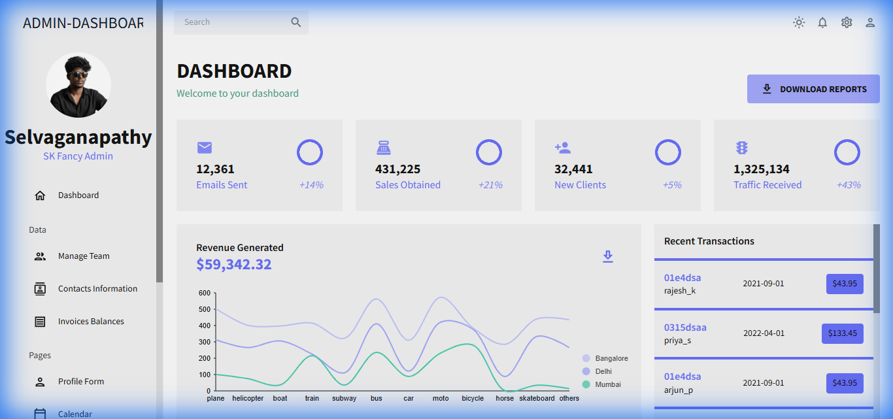
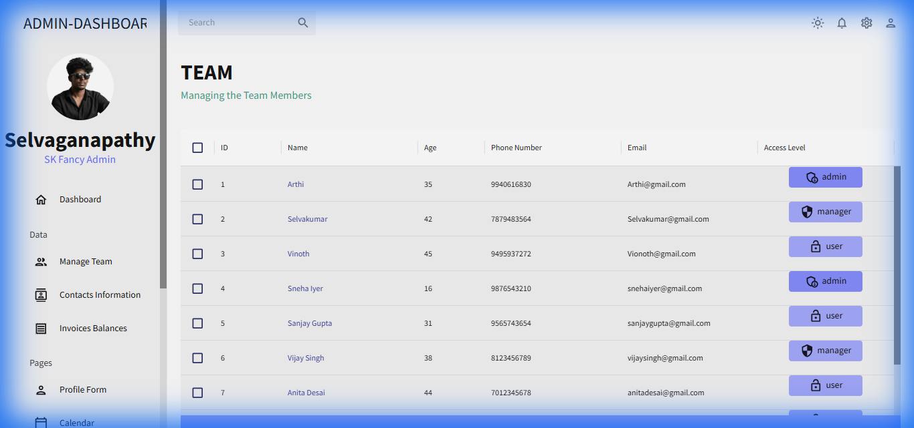
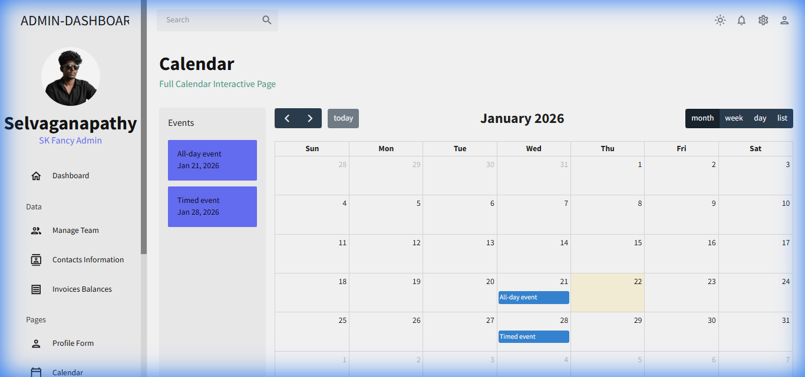

# 🚀 React Admin Dashboard

> A professional, modern, and responsive Admin Dashboard built with React, Material UI, and Nivo Charts.

[](https://admin-dashboard-one-zeta-57.vercel.app)
[](https://opensource.org/licenses/MIT)

## 📸 Screenshots


*Dashboard Overview containing key metrics and charts.*

<!-- Add more screenshots here -->
<p align="center">
  
  
</p>

## ✨ Features

- **📊 Comprehensive Dashboard**: Real-time overview of key metrics like emails sent, sales, new clients, and traffic.
- **📈 Interactive Charts**: Visualized data using **Nivo Charts** (Bar, Pie, Line, Geography) and **Chart.js**.
- **📅 Full Calendar**: Integrated event management using **FullCalendar**.
- **📋 Data Management**:
  - **Team Management**: View and manage team members with role-based access.
  - **Contacts**: Detailed contact information table.
  - **Invoices**: Track balances and invoice history.
- **📝 Form Handling**: Validated profile forms using **Formik** and **Yup**.
- **🌗 Dark/Light Mode**: Fully themable UI with dark and light mode support using **Material UI**.
- **📱 Responsive Design**: Optimized for various screen sizes with a collapsible sidebar.

## 🛠️ Tech Stack

- **Frontend Framework**: [React 19](https://react.dev/)
- **Build Tool**: [Vite](https://vitejs.dev/)
- **UI Component Library**: [Material UI (MUI)](https://mui.com/)
- **Charts**: [Nivo Charts](https://nivo.rocks/) & [React Chartjs 2](https://react-chartjs-2.js.org/)
- **Data Grid**: [MUI Data Grid](https://mui.com/x/react-data-grid/)
- **Form Validation**: [Formik](https://formik.org/) & [Yup](https://github.com/jquense/yup)
- **Calendar**: [FullCalendar](https://fullcalendar.io/)
- **Routing**: [React Router DOM](https://reactrouter.com/)

## 🚀 Getting Started

### Prerequisites

Make sure you have **Node.js** installed on your machine.

### Installation

1. **Clone the repository**
   ```bash
   git clone https://github.com/selvaganapathycoder/Admin-Dashboard.git
   cd Admin-Dashboard
   ```

2. **Install dependencies**
   ```bash
   npm install
   ```

3. **Run the development server**
   ```bash
   npm start
   ```

4. **Build for production**
   ```bash
   npm run build
   ```

## 📂 Project Structure

```bash
src/
├── components/       # Reusable UI components (Header, Charts, Stats)
├── data/            # Mock data for demonstration
├── scenes/          # Page views (Dashboard, Team, Contacts, etc.)
│   ├── dashboard/   # Main dashboard view
│   ├── global/      # Global components (Sidebar, Topbar)
│   └── ...          # Other pages (Calendar, FAQ, Form, etc.)
├── theme.js         # Color tokens and theme configuration
└── App.js           # Main application entry point
```

## 👤 Author

**Selvaganapathy (SK Fancy Admin)**
- GitHub: [@selvaganapathycoder](https://github.com/selvaganapathycoder)

## 🤝 Contributing

Contributions, issues, and feature requests are welcome!

1. Fork the Project
2. Create your Feature Branch (`git checkout -b feature/AmazingFeature`)
3. Commit your Changes (`git commit -m 'Add some AmazingFeature'`)
4. Push to the Branch (`git push origin feature/AmazingFeature`)
5. Open a Pull Request
